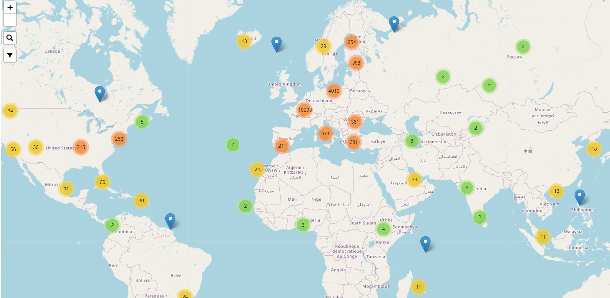
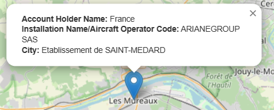
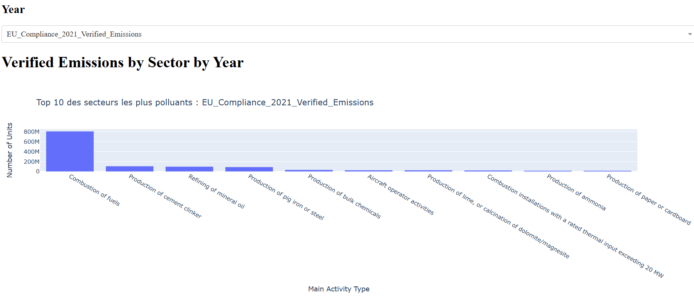

# Europa_Scraping


## A propos du projet

Bienvenue dans le repository dédié à notre projet Science Po pour le semestre 2 de 2023. Ce repository est destiné à rassembler notre code et faciliter la collaboration entre nous.

Notre projet consiste à effectuer du web scraping sur le site https://ec.europa.eu/clima/ets/welcome.do?languageCode=fr afin de collecter des données précises.

De notre coté le projet est fini, mais n'hésitez pas à le copier ou à vous en inspirer pour vos propres projets.


### language utilisé

Python 3.10.5 - Projet Scrapy  
<br>


<!-- GETTING STARTED -->
## Pour commencer

### Pré-requis

Pour l'extraction de données
- Scrapy 2.7.1  
les autres librairies tel que **logging** et **datetime** devrait être integré dans la bibliothèque standart de votre version python  

Pour les dashboards
- numpy 1.24.1 pour manipuler les données
- pandas 1.5.3 pour manipuler les données
- plotly 5.13.1 pour créer des graphiques
- dash 2.9.1 pour développer des applications web pour la visualisation des données
- geopy 2.3.0 to get latitude and longitude coordinates for addresses 
- folium 0.14.0 to create an interactive map centered on the mean Latitude and Longitude of the holding accounts

### Installation

1. Cloner le dépôt du projet : git clone https://github.com/MunznerLouis/Europa_Scraping

2. Naviguer dans le répertoire du projet : cd votre-projet

3. Installer les dépendances : pip install -r requirements.txt  
<br>


<!-- USAGE EXAMPLES -->
## Utilisation
### Pour le Scraping
Pour lancer une Spider contenu dans le dossier 'spiders' du projet :    
  
1. Dans votre environnement ,lancez la commande suivante :  
scrapy runspdier [fichier spider qu'on veut lancer] exemple:  
-**scrapy runspider europa_spider.py**  
Cela aura pour effet de scraper le site, mais les données seront sauvegardées nulle part  
pour sauvegarder les données quelque part, suivre l'étape 2 : 

2. lancer la commande suivante :   
scrapy runspider [fichier de la classe spider] -O [nom de fichier avec son extension]  
le 'o' peut etre en majuscule si on veut Override le fichier du même nom  
exemple :  
-**scrapy runspider europa_spider.py -O ../../data.csv**    
  
PS : l'étape 2 remplace l'étape 1 dans le cas ou on veut sauvegarder les données scrapées  

### Pour les dashboards
Dans votre environnement ,lancez la commande suivante :  
python nom_fichier.py  
<br>

## Resultats Scraping

les deux spiders se trouve à cette endroit dans le projet  :
```\scrapy_scraper\scrapy_scraper\spiders\```  :

- europa_spider.py  (pour la partie des sites polluants)
- transaction_spider.py  (pour la partie transaction)

pour ce qui est de nos .csv il s'agit de :
- data_holding_account.csv  (13Mo)
    - 250 colonnes
    - nombre de lignes : 17 910
    - temps de scraping : ~13min (15requetes/s)
- data_transaction.csv  (200Mo)
    - 15 colonnes
    - nombre de lignes : 1 106 821
    - temps de scraping : ~13heure (18requetes/s)

## Resultats Dashboard

Avec les données collectés nous avons pu créer une carte interactive pour permettre de visualiser des informations liées aux entreprises lorsqu'on passe la souris dessus. Nous avons aussi pu produire plusieurs graphiques permettant de mieux comprendre les données extraites lors du scraping.




Nous avons également pu produire plusieurs graphs, mais dans l'optique de ne pas inonder le ReadMe nous ne les présenterons pas tous : 


<!-- CONTRIBUTING -->

## Contribution

Nous sommes heureux de vous annoncer que notre projet Science Po pour le semestre 2 de 2023 est désormais terminé. (On a eu 18/20!🥳)

Nous souhaitons cependant vous informer que ce repository ne sera plus mis à jour et n'acceptera donc plus de contributions. Néanmoins, nous vous encourageons vivement à vous inspirer de notre code ou à le copier pour vos propres projets si cela peut vous être utile.

<!-- CONTACT -->
## Contact

- Münzner Louis - munzner.louis@gmail.com 

- Brise Quentin - brisequent@cy-tech.fr 

- Zeddam Hatem - zeddamhate@cy-tech.fr  

- Noyes Enzo - noyesenzo@cy-tech.fr   

Project Link: [https://github.com/MunznerLouis/Europa_Scraping](https://github.com/MunznerLouis/Europa_Scraping)


